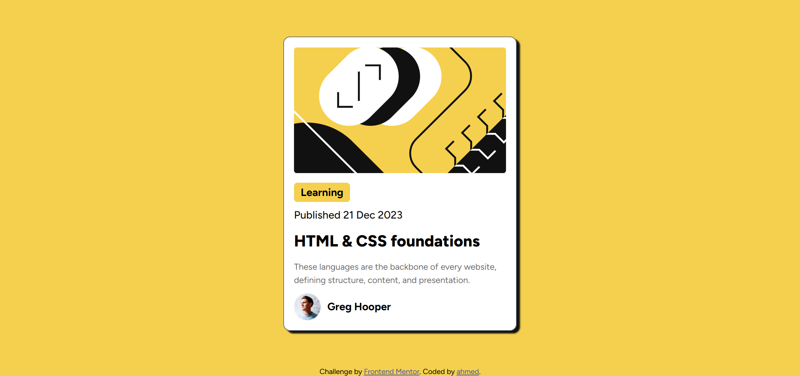

# Blog Preview Card

This is a solution to the **Blog Preview Card** challenge on Frontend Mentor.

## 🔗 Links

- Solution URL: https://www.frontendmentor.io/solutions/blog-preview-card
- Live Site URL: https://ahmednasri32.github.io/blog-preview-card

## 🛠️ Built with

- HTML5
- CSS3
- CSS Grid
- Flexbox
- CSS Variables
- Google Fonts

## ✨ What I learned

- Better use of CSS variables for colors
- Centering elements using CSS Grid
- Writing clean and structured HTML

## 📸 Screenshot

## 👤 Author

- GitHub: https://github.com/ahmednasri32
- Frontend Mentor: https://www.frontendmentor.io/profile/ahmednasri32
